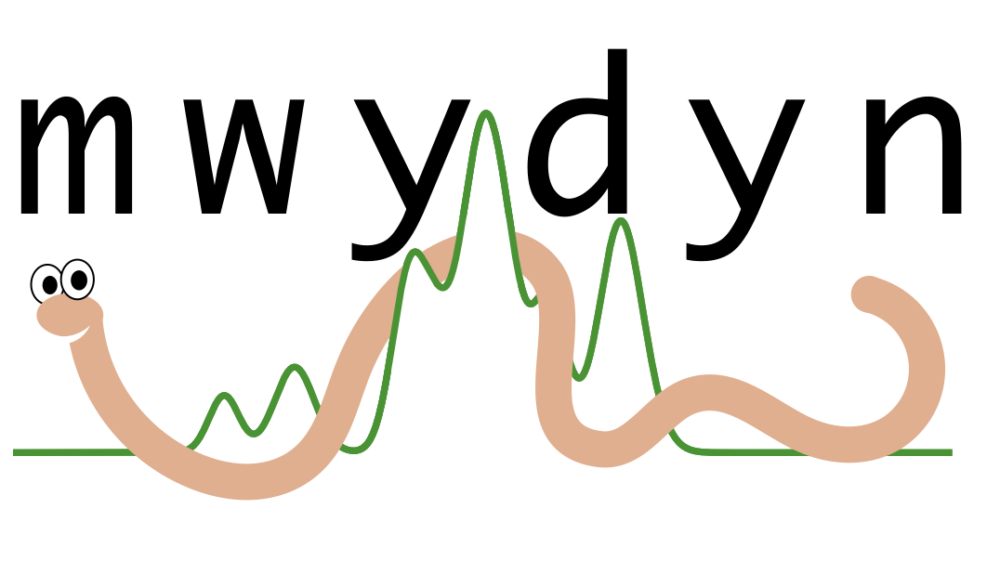

`mwydyn` (*Welsh*: worm; *pronounced*: muy-din; IPA: [ˈmʊi̯dɪn])

# About

`mwydyn` is a fully-automated multiple velocity component hyperfine line-fitting code.

*2024-01-08: Public release coming soon...*

## Developers

`mwydyn` was developed by:
* Michael Anderson
* Andrew Rigby

With contributions from:
* Nicolas Peretto
* Gwenllian Williams
