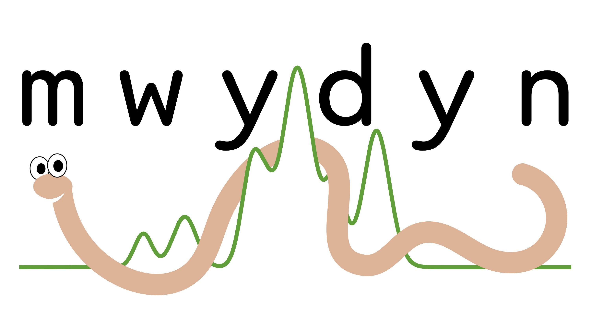

`mwydyn` (_Welsh_: worm; _pronounced_: muy-din; IPA: [ˈmʊi̯dɪn])

# About

`mwydyn` is a fully-automated multiple velocity component hyperfine line-fitting code.

_2024-07-08: Public release coming summer 2024..._

## Citation

If you use `mwydyn` please consider citing [Rigby et al. (2024)](https://ui.adsabs.harvard.edu/abs/2024MNRAS.528.1172R/abstract) and Anderson et al. (in prep).

## Developers

`mwydyn` was developed by:

- Michael Anderson
- Andrew Rigby

With contributions from:

- Nicolas Peretto
- Gwenllian Williams
- Sarah Ragan
