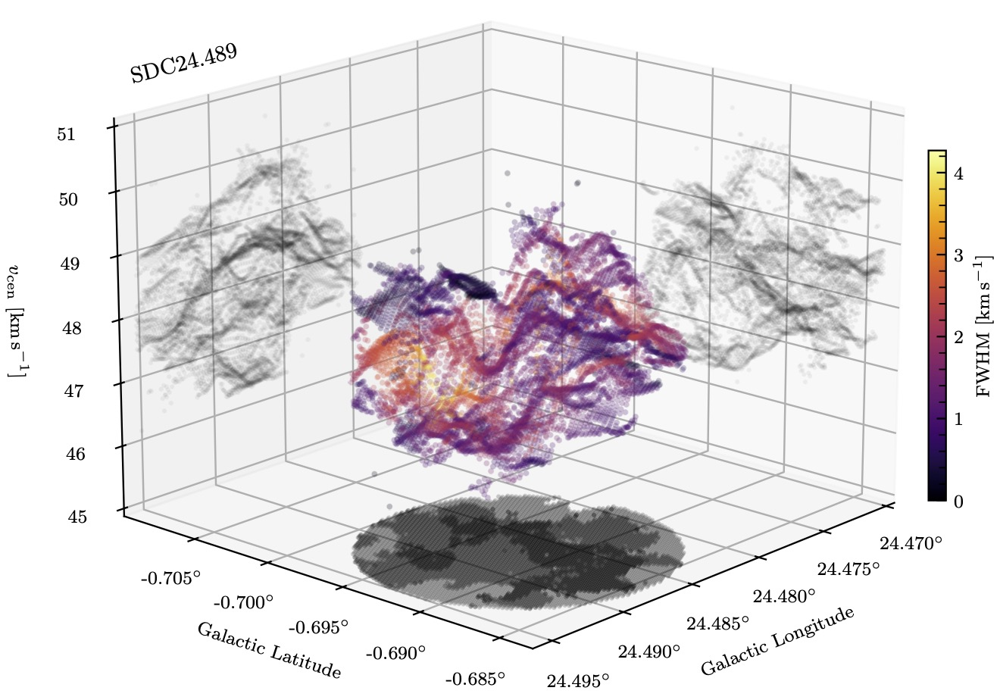

<p align="center">

</p>

`mwydyn` (_Welsh_: worm; _pronounced_: muy-din; IPA: [ˈmʊi̯dɪn])


# About

`mwydyn` is a fully-automated multiple velocity component hyperfine line-fitting code.

**Motivation**: The code was written to perform automatic spectral-decomposition of N<sub>2</sub>H<sup>+</sup> (1-0) data cubes using a hyperfine model. We were finding that in much of our data, the 'isolated' component of N<sub>2</sub>H<sup>+</sup> (1-0) that is often used for Gaussian decomposition was heavily blended, and so we had to model the full hyperfine structure for effective decomposition. This code largely follows the hyperfine modeling implemented by [GILDAS/CLASS](https://www.iram.fr/IRAMFR/GILDAS/doc/html/class-html/node8.html), and is subject to the same assumptions and caveats. While, by default we allow up to 3 separate N<sub>2</sub>H<sup>+</sup> (1-0) velocity components per spectrum, in principle this is extensible to an arbitrary number, as well as other molecules or transitions with hyperfine structure.

## Credit

`mwydyn` was developed by:

- Michael Anderson
- Andrew Rigby

With contributions from:

- Nicolas Peretto
- Gwenllian Williams
- Sarah Ragan

If you use `mwydyn` please consider citing [Rigby et al. (2024)](https://ui.adsabs.harvard.edu/abs/2024MNRAS.528.1172R/abstract) and Anderson et al. (in prep).

[](https://doi.org/10.5281/zenodo.12821279)

## Performance statistics
- 57 spectra per minute per core (Apple M3 Pro, 2023)
- 33 spectra per minute per core (Apple M2, 2022)
- 10 spectra per minute per core (Intel Xeon E5-2640 v4 2.40GHz, 2016)

# Dependencies

`mwydyn` was written and tested in python version 3.9.18. It requires the following packages, and has been tested on the version in parentheses.

- astropy (5.1.1)
- lmfit (1.3.2)
- matplotlib (3.8.2)
- numpy (1.26.4)
- packaging (23.2)
- tqdm (4.66.4)


For more up-to-date versions of python, (e.g. 3.11.x), some of the parallel processing implementation has changed, so for the time being we recommend running `mwydyn` in a 3.9 virtual environment if you wish to use that feature.

# Installation

While we hope to eventually convert `mwydyn` into a `pip`-installable package, it is simple to use as a script. The recommended procedure is to install directly from this github page:

```console
$ cd /your/project/directory
$ git clone https://github.com/mphanderson/mwydyn.git
```

# Usage

The code can be run either from the terminal, or from within an ipyhton environment (recommended). You can specify either a config file, a data file, or both as command line arguments:

```console
$ python mwydyn.py myconfig.ini mydata.fits
```

We recommend running the code from inside an ipython environment in order to use some of the interactive plotting features:

```python
In [1]: run mwydyn.py myconfig.ini mydata.fits
```

This will run the code using the named config file and input data filename. If there is an input filename in the config, then it will be ignored and the command line argument will be used instead.

```python
In [1]: run mwydyn.py myconfig.ini
```

This will run the code with the named config file, and use whatever input data filename is listed in the config. If there isn’t one in there, it will complain and quit.

```python
In [1]: run mwydyn.py mydata.fits
```

This will run the code with the default `config.ini` file in the main directory and use the command line input data filename.


# How it works

`mwydyn` runs with two basic steps:

1. Initial fitting
2. Spatial refinement

In the **initial fitting** step, the code will start off by cycling through each of the spectra in your data cube that satisfy the signal-to-noise ratio criterion `snrlim`, and attempts to fit up to `N_max` (defined in the config file) components per spectrum using the [`lmfit`](https://lmfit.github.io/lmfit-py/) module. It devises some initial guesses for the fit parameters based on the location of the brightest channel and the spread in velocity of channels which are deemed to be detections. The code then determines which combination of components is the optimum, preferring fewer components unless as significant improvement in the BIC value (our goodness of fit metric) is obtained with more components.

Until this point, each spectrum has been treated independently. The **spatial refinement** step allows some level of communication between neighbouring pixels, which will not be independent if your pixels are sampling your telescope beam sensibly. The spectra are cycled through again up to a number of times specified by the `CleanIter` argument, and neighbouring spectra are inspected for better fits. If a local spectrum has a better fit, then we now attempt to refit the current spectrum using the fit parameters of the better fit as the initial guesses. If a better fit is obtained, we keep the new fit, or else keep the old one. This cycling allows the best fit parameters to percolate through the data cube. If later iterations of spatial refinement are making no difference, this step is terminated early to save time.

### Demonstration:

`mwydyn` is packaged with some small test N<sub>2</sub>H<sup>+</sup> (1-0) data cubes from ALMA (Anderson et al. in prep.) and NOEMA (Rigby et al. 2024) to demonstrate the functionality.
We include `config_demo_alma.ini` and `config_demo_noema.ini` to demonstrate how `mwydyn` works on these cubes. Let's try fitting the ALMA cube:

```python
In [1]: run mwydyn.py config_demo_alma.ini
```
```console

 Input data not specified in command line, using configuration file entry.

 ======================= Running mwydyn ===========================
 File: SDC326_n2h+_TP+7m+12m.subcube.fits
 Config file: config_demo_alma.ini
 Maximum no. components: 3
 Minimum S/N: 10.0
 Critical BIC value: 20.0
 Initial FWHM guess: 0.5
 Initial tau guess: 0.2
 Fitting method: leastsq
 Fit constraints: True
 Parallel processing on 4 processors
 Cleaning iterations: 10
 Cleaning radius: 2 pixels

 Fitting each spectrum : 100%|██████████████████████████████████████████| 256/256 [01:09<00:00,  3.70it/s]
 Spatial refinement    :  40%|█████████████████▍                           | 4/10 [00:21<00:33,  5.65s/it]
 No new results on refinement iteration 4: stopping.

 Data products saved to: /your/project/directory/mwydyn/data_products/

 * Click on a pixel to inspect the spectrum and fit

 Finished in 1.69 minutes
 ==================================================================
```

This has run `mwydyn` over the data cube, and stored the products in the `data_products/` directory. If running in iPython, some interactive figures pop up at completion. The first is the summary figure:

<p align="center">

</p>

Which gives some quick-look images comparing, for example, the integrated intensity of the input cube (top left) with the integrated intensity of the resulting model cube (top middle left), and the number of fitted components per spectrum (top right).

In this figure, you can also click on individual pixels in the various maps to inspect the fits to the spectra. For example, the model for the spectrum at pixel coordinates (8, 7) is:

<p align="center">

</p>

Which has been fitted with 2 components, one broad (FWHM = 3.7 km/s) and one narrow (1.0 km/s).

Secondly, a figure showing the results of the spatial refinement step appears:

<p align="center">

</p>

This figure shows the integrated intensity of the model cube after each step of spatial refinement. The top row shows the integrated intensity of the model at each step compared to the original data on the left. The second row shows the difference between the model and data for the relevant stage, and the fourth row shows the residual of the model refined at each iteration compared to the previous one. The third row shows the corresponding maps of BIC (lower values = better fit). Two figures in the left column show a map of the number of refits used per spectrum and the iteration at which those pixels were last refined: in this case, no spectrum was refit more than once. These allow the user to check how the refits percolate across the map, and give an idea of whether you might need to increase the value of `CleanIter`. Although we ran with `CleanIter = 10` in this run, no further refinement was made after the third iteration, and so the code finished early.

# Configuring `mwydyn`

The main code is `mwydyn.py`, which should be called with either a configuration file as an argument and, optionally, a filename for the cube you wish to fit. Most of the behaviour is controlled by a configuration file. By default, it is configured for fitting N<sub>2</sub>H<sup>+</sup> (1-0) spectra which should run very smoothly. For other species, some minimal modification will be required.

The variables that should be defined to run and customise the code are stored in a configuration (.ini) file which, by default, will be the supplied file called `config.ini`. The configuration file is organised in five blocks: `[paths]`, `[input]`, `[processing]`, `[fitting]`, and `[output]`, and here we summarise what each of the variables do. The default values are listed in square brackets.

### Paths

* `path` - The path to main directory where `mwydyn.py` is located. A value of `default` will attempt to do this automatically. [`default`]
* `input_dir` - The location of the input data directory relative to `path/`. [`data_in/`]
* `prod_dir` - The location to store the output of `mwydyn` relative to `path/`. [`data_products/`]
* `model_dir` - The location of the model files for the molecule relative to `path/`. [`models/`]

### Input

* `input_fn` - The name of the .fits file on which `mwydyn` will be run, or set to `user` to input your filename as a command line argument. [`user`]
* `subcube` - Set to `True` to perform the fit on a subcube. This is useful for testing a setup quickly, without running over the full cube. [`False`]
* `subcube_bounds` - If running `mwydyn` on a subcube, define the pixel coordinates of the boundaries here as a list of [`[ymin, ymax, xmin, xmax]`]. [`[10, 14, 10, 14]`]

### Processing

* `parallel` - Set to `True` to use parallel processing. [`True`]
* `nproc` - The number of processors to use in parallel mode. Set to `auto` to automatically set to the number of processors on your machine, minus one. [`4`]

### Fitting

* `rmschan` - Number of channels (assumed to be emission-free) from each end of the cube used to calculate the rms map. [`25`]
* `snrlim` - Minimum signal-to-noise ratio of the brightest channel in a spectrum in order for a fit to be performed. [`10`]
* `N_max` - Maximum number of velocity components allowed to be fitted per spectrum. Must be 1 >= `N_max` <= 3. [`3`]
* `delbic` - The minimum improvement in BIC for a higher number of components to be preferred over the previous fit. [`20`]
* `fwhm_guess` - Initial guess for the FWHM per component in km/s. [0.5]
* `tau_guess` - Initial guess for the optical depth per component. [0.2]
* `fwhm_limits` - Min & max FWHM values allowed in km/s. [`0.1, 10`]
* `tau_limits` - Min & max tau values allowed. [`0.1, 30`]
* `v_guess_tolerance` - Upper and lower bound of automatic VLSR guess in km/s for each component, i.e. `v_guess` ± `v_guess_tolerance`. [`20`]
* `line_model` - Name of the model `.json` file to be used. [`n2h+_1-0`]
* `min_dv` - Minimum separation of velocity components in km/s. [`0.4`]
* `constrain_fits` - If `True`, constrain the minimum peak intensity of model components. No model component will have a peak intensity < `snrlim`. [`True`]
* `method` - `lmfit` method to be used e.g. `leastsq`, `emcee`. [`leastsq`]
* `verbose` - If `True`, produces more print statements. [`False`]
* `cleaniter` - The maximum number of iterations of spatial refinement to run. [`10`]
* `refrad` - Search radius, in pixels, when refining fits. [`2`]
* `use_integ_res` - If `True`, insist that refined fits need lower integrated residuals. [`False`]

### Output

* `save_products` - If `True`, write out `.fits` files of the data products. [`True`]
* `do_summary_figures` - If `True`, show figures upon completion? (INTERACTIVE ONLY). [`True`]
* `do_plots` - Create a figure for each fitted spectrum? (SMALL SUBCUBES ONLY). [`False`]
* `save_figures` - If `True`, writes out a the summary and spatial refit figures as `.pdf`. [`True`]
* `save_table` - If `True`, writes a .fits table containing the results. [`True`]

# Results

Upon completion, the output data products will be saved in `prod_dir`, with the same filename as the input data, but with a suffix to specify the product. The data products are:

- ` _bic.fits` - 2D map of the BIC parameter for each pixel's fit.
- ` _data.fits` - A copy of the input data, for convenience.
- ` _model.fits` - A data cube containing the best-fitting model.
- ` _ncomp.fits` - 2D map of the number of fitted velocity components.
- ` _p1_Ttau.fits` - Cube with the value of fit parameter 1 for nth component in nth channel.
- ` _p2_vcen.fits` - Cube with the value of fit parameter 2 for nth component in nth channel.
- ` _p3_fwhm.fits` - Cube with the value of fit parameter 3 for nth component in nth channel.
- ` _p4_taum.fits` - Cube with the value of fit parameter 4 for nth component in nth channel.
- ` _quality.fits` - 2D map of the fit convergence flag. 1 for yes, 0 for no.
- ` _rchi.fits` - 2D map of the reduced chi-squared of the fit.
- ` _refits.fits` - 2D map of the number of spatial refinements for each pixel.
- ` _residuals.fits` - Cube of the residuals, i.e. `residuals` = `data` - `model`.
- ` _rms.fits` - 2D map of the per-spectrum RMS noise.
- ` _specID.fits` - 2D map containing an ID for each spectrum for debugging.
- ` _table.fits` - A convenient .fits table containing the results.

We find that the `_table.fits` is the most convenient data product, and all of the other data is located in this single file. It is very convenient for a quick exploration of the results using [TOPCAT](https://www.star.bris.ac.uk/~mbt/topcat/), for example, or else by reading the table in to python using [astropy.table](https://docs.astropy.org/en/stable/table/). E.g.

```python
import matplotlib.pyplot as plt
from astropy.table import Table

table = Table.read('data_products/SDC326_n2h+_TP+7m+12m.subcube_table.fits')

fig = plt.figure()
ax = fig.add_subplot(111, projection='3d')
cax = ax.scatter(table['x_ind'], table['y_ind'], table['vlsr'], c=table['int_T_ant'])
ax.set_xlabel('x pixels')
ax.set_ylabel('y pixels')
ax.set_zlabel('Velocity (km/s)')
cbar = fig.colorbar(cax)
cbar.set_label('Integrated intensity [K km/s]')

plt.show()
```

<p align="center">

</p>


# Showcases

### Application to NOEMA data

Here's an example figure generated from the `mwydyn` decomposition of NOEMA observations of the centre of the infrared dark cloud SDC24.489-0.689 (of which a subset of the data is packaged here) in N<sub>2</sub>H<sup>+</sup> (1-0) from [Rigby et al. (2024)](https://ui.adsabs.harvard.edu/abs/2024MNRAS.528.1172R/abstract):

<p align="center">

</p>

This figure is essentially a polished version of the example above. This shows the position of each component obtained by `mwydyn` in position-position-velocity space. The points are coloured by the FWHM of the component, and the transparency of the points is scaled by the integrated intensity of the component. Against each surface, the greyscale image shows the project of the number of components across the relevant axis, so the bottom surface, for example, shows the number of components fitted to each spectrum. The analysis has revealed the incredible complexity of structures in the cloud, with a combination of filaments, sheets, and cavities in position-position-velocity space (though we note that will probably not represent the same kinds of structures in position-position-position space). These particular NOEMA observations were only a single deep pointing, and so the decomposition has a sharp circular edge at the extent of the primary beam - a bit like removing the core from an apple.

### Application to ALMA data

Here is another example figure showing the decomposition of SDC326.476+0.706, a hub-filament system observed with ALMA 12m+7m+TP, in N<sub>2</sub>H<sup>+</sup> (1-0), from Anderson et al. (in prep.). The observations were taken as mosaic of multiple pointings, completely mapping both the dense central regions of the hub to the outer filamentary structures.

<p align="center">

</p>

Similar to the figure above, the points are coloured by the FWHM, and transparency scaled by the integrated intensity of the component, and on each surface is a 2D projection of the number of components across the relevant axis. The lower surface, showing the number of components fitted to each spectrum, also shows the positions of cores presented in [Anderson et al. (2021)](https://ui.adsabs.harvard.edu/abs/2021MNRAS.508.2964A/abstract) marked with boxes. We see that the gas has typically low velocity dispersion in the filament-dominated region, which gradually increases towards the hub-dominated region. The number of fitted components also increases towards the hub centres, with some increases elsewhere that may be due to overlapping filamentary structures or the presence of cores.
